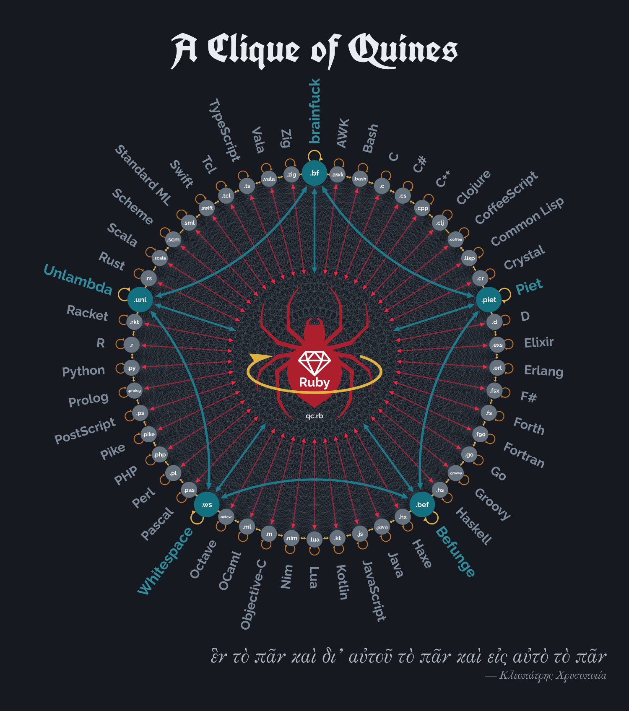
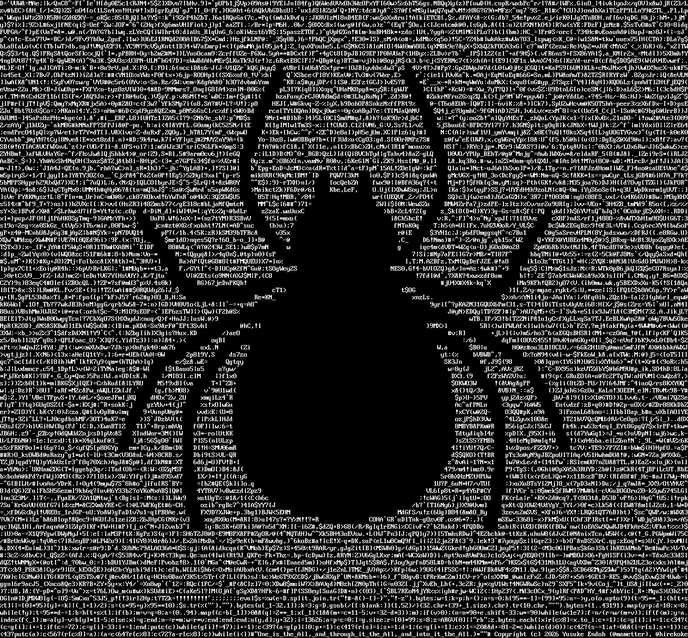
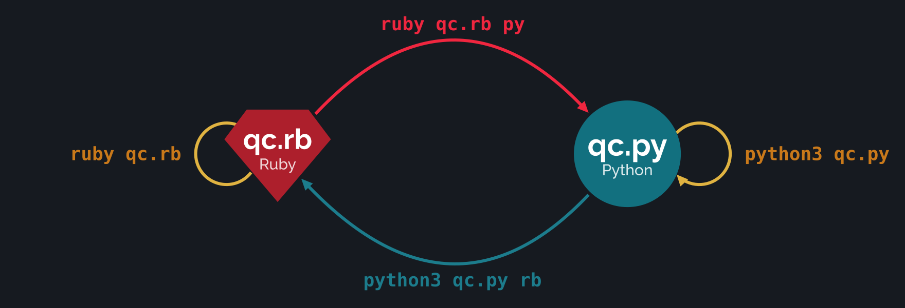
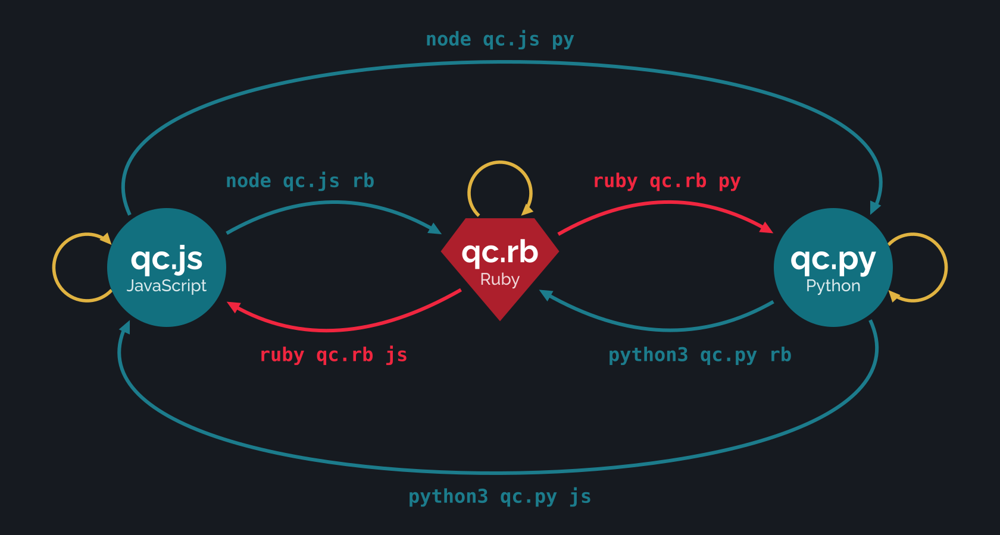

# Quine Clique

[qc.rb](qc.rb) is a quine written in Ruby: a program that prints itself.
Ask it for Python, and it prints a Python quine instead.
Or a JavaScript quine. Or a Rust quine. Or a C quine.
Or any of 50 languages in all.

Every one of those quines can do the same: all of them can generate *each other*.
A [clique](https://en.wikipedia.org/wiki/Clique_(graph_theory)) of quines.



[&#9654; Video explanation (9 min)](https://www.youtube.com/watch?v=3f2wV7Odq8E)

## Quine Clique 101

### Ruby Quine

Here is `qc.rb`:



This is a Ruby program.
It is a quine.
Run it, and it prints itself.

```console
$ ruby qc.rb > out.bin
$ diff -s qc.rb out.bin
Files qc.rb and out.bin are identical
```

### Ruby → Python

Run `qc.rb` with the argument `py`, and it prints a quine written in Python.

```console
$ ruby qc.rb py > qc.py
```

Let's run it.

```console
$ python3 qc.py > out.bin
$ diff -s qc.py out.bin
Files qc.py and out.bin are identical
```

### Python → Ruby

Now, run `qc.py` with the argument `rb`. It prints `qc.rb`.

```console
$ python3 qc.py rb > out.bin
$ diff -s qc.rb out.bin
Files qc.rb and out.bin are identical
```

That is, `qc.rb` and `qc.py` are each a quine, and they print each other depending on the argument.
This is called a [multiquine](https://en.wikipedia.org/wiki/Quine_(computing)#Multiquines).



### Ruby ↔ JavaScript

Python is not the only thing `qc.rb` can print.
With the argument `js`, it prints a quine written in JavaScript.

```console
$ ruby qc.rb js > qc.js
$ node qc.js > out.bin
$ diff -s qc.js out.bin
Files qc.js and out.bin are identical
```

Of course, `qc.js` can print `qc.rb` too.

```console
$ node qc.js rb > out.bin
$ diff -s qc.rb out.bin
Files qc.rb and out.bin are identical
```

### Python ↔ JavaScript

And Python and JavaScript can print each other as well.

```console
$ python3 qc.py js > out.bin
$ diff -s qc.js out.bin
Files qc.js and out.bin are identical

$ node qc.js py > out.bin
$ diff -s qc.py out.bin
Files qc.py and out.bin are identical
```

That is, `qc.rb`, `qc.py`, and `qc.js` are each a quine, and they print each other depending on the argument.



## 50 + 1 languages

In the same way, it supports 50 languages in total. Including Ruby itself, that makes 51.
The picture at the top is this very graph: every arrow is a pair of programs that print each other.

Notably, it supports 5 esoteric languages: brainfuck, Befunge, Whitespace, Piet, and Unlambda.
They do not support command-line arguments, so give the language name on standard input.

```console
$ ruby qc.rb bf > qc.bf

# qc.bf is a quine
$ echo | vendor/bin/bf qc.bf > out.bin
$ diff -s qc.bf out.bin
Files qc.bf and out.bin are identical

# qc.bf can print qc.rb
$ echo rb | vendor/bin/bf qc.bf > out.bin
$ diff -s qc.rb out.bin
Files qc.rb and out.bin are identical
```

## Languages

This program is tested with the following Ubuntu packages.

\# |language     |ubuntu package  |version
---|-------------|----------------|-----------------------------------
1  |Ruby         |ruby            |1:3.3build1
2  |AWK          |gawk            |1:5.3.2-1ubuntu1.1
3  |Bash         |bash            |5.3-2ubuntu1
4  |Befunge      |*N/A*           |-
5  |brainfuck    |*N/A*           |-
6  |C            |gcc             |4:15.2.0-5ubuntu1
7  |C#           |mono-devel      |6.14.1+ds2-2
8  |C++          |g++             |4:15.2.0-5ubuntu1
9  |Clojure      |clojure         |1.12.0-1build2
10 |CoffeeScript |coffeescript    |2.7.0+dfsg1-4
11 |Common Lisp  |clisp           |1:2.49.20250504.gitf662209-2
12 |Crystal      |crystal         |1.18.2+dfsg-1
13 |D            |gdc             |4:15.2.0-5ubuntu1
14 |Elixir       |elixir          |1.18.3.dfsg-1build1
15 |Erlang       |erlang          |1:27.3.4.6+dfsg-1
16 |F#           |dotnet-sdk-10.0 |10.0.111-0ubuntu1\~26.04.1
17 |Forth        |gforth          |0.7.3+dfsg-9build4.1
18 |Fortran      |gfortran        |4:15.2.0-5ubuntu1
19 |Go           |golang          |2:1.26\~1
20 |Groovy       |groovy          |2.4.21-10build1
21 |Haskell      |ghc             |9.10.3-4
22 |Haxe         |haxe            |1:4.3.7-1.1
23 |Java         |openjdk-25-jdk  |25.0.4+7-1\~26.04
24 |JavaScript   |nodejs          |22.22.1+dfsg+\~cs22.19.15-1ubuntu1
25 |Kotlin       |kotlin          |1.3.31+ds1-3ubuntu1
26 |Lua          |lua5.3          |5.3.6-3
27 |Nim          |nim             |2.2.4-2
28 |Objective-C  |gobjc           |4:15.2.0-5ubuntu1
29 |OCaml        |ocaml           |5.4.0-3ubuntu1
30 |Octave       |octave          |11.1.0-3
31 |Pascal       |fp-compiler     |3.2.2+dfsg-49
32 |Perl         |perl            |5.40.1-7ubuntu0.1
33 |PHP          |php-cli         |2:8.5+99ubuntu1
34 |Piet         |*N/A*           |-
35 |Pike         |pike8.0         |8.0.1956-4
36 |PostScript   |ghostscript     |10.06.0\~dfsg-3ubuntu1
37 |Prolog       |swi-prolog      |9.2.9+dfsg-1.1build1
38 |Python       |python3         |3.14.3-0ubuntu2
39 |R            |r-base          |4.5.2-1ubuntu2
40 |Racket       |racket          |8.18+dfsg1-1ubuntu1
41 |Rust         |rustc           |1.93.1ubuntu1
42 |Scala        |scala           |2.11.12-6build1
43 |Scheme       |guile-3.0       |3.0.11-2
44 |Standard ML  |mlton           |20241230+git20251029+dfsg-5
45 |Swift        |swiftlang       |6.1.3-4build1
46 |Tcl          |tcl             |8.6.16build1
47 |TypeScript   |node-typescript |5.2.2-2
48 |Unlambda     |*N/A*           |-
49 |Vala         |valac           |0.56.18-7
50 |Whitespace   |*N/A*           |-
51 |Zig          |zig             |0.14.1\~us1-0ubuntu4

The languages marked *N/A* are not available in Ubuntu.
This repository contains their interpreters in `vendor/`.

## Usage

1. If you are using Ubuntu 26.04, you can install the dependencies with:

```console
$ sudo apt install bash clisp clojure coffeescript crystal \
      dotnet-sdk-10.0 elixir erlang fp-compiler g++ gawk gcc gdc gforth \
      gfortran ghc ghostscript gobjc golang groovy guile-3.0 haxe kotlin \
      libgif-dev libgmp-dev lua5.3 make mlton mono-devel nim node-typescript \
      nodejs ocaml octave openjdk-25-jdk perl php-cli pike8.0 python3 r-base \
      racket ruby rustc scala swi-prolog swiftlang tcl valac zig
```

2. Then, build the bundled interpreters:

```console
$ make -C vendor
```

3. Then, run `make members`. This generates the whole clique: qc.py, qc.js, qc.rs, ...

```console
$ make members
$ ls qc.*
qc.awk qc.bash qc.bef qc.bf qc.c qc.clj qc.coffee qc.cpp qc.cr qc.cs
qc.d qc.erl qc.exs qc.f90 qc.fs qc.fsx qc.go qc.groovy qc.hs qc.hx
qc.java qc.js qc.kt qc.lisp qc.lua qc.m qc.ml qc.nim qc.octave qc.pas
qc.php qc.piet.gif qc.pike qc.pl qc.prolog qc.ps qc.py qc.r qc.rb
qc.rkt qc.rs qc.scala qc.scm qc.sml qc.swift qc.tcl qc.ts qc.unl
qc.vala qc.ws qc.zig
```

4. To verify that every language can print every other, run `make test-all`. It takes hours.

```console
$ make test-all
```

All 51 x 51 = 2,601 combinations are checked by GitHub Actions on every push.

Alternatively, build the Docker image and run the tests in a container:

```console
$ docker build -t quine-clique .
$ docker run --rm quine-clique
```

## FAQ

### Why?

Why not?

### How?

See [docs/internal.md](docs/internal.md), or [watch the video](https://www.youtube.com/watch?v=3f2wV7Odq8E).

## Related work

- [Quine Relay](https://github.com/mame/quine-relay) (2013).
  A quine that returns to itself by way of 128 languages. A one-way chain, not a multiquine.
- [Quine Chameleon](https://github.com/coolwanglu/quine-chameleon) (2015).
  A 25-language multiquine. It is restricted to languages whose string literals support C-style escapes (`\"` and `\\`).
- [Multiquine with ELVM](https://mametter.hatenablog.com/entry/20161222/p1) (2016, Japanese).
  A multiquine prototype based on [ELVM](https://github.com/shinh/elvm), a compilation infrastructure for esolangs. ELVM is not multiquine-specific, and brainfuck could not be run in realistic time there.

## License

The MIT License (MIT)

Copyright (c) 2026 Yusuke Endoh (@mametter), @hirekoke

Permission is hereby granted, free of charge, to any person obtaining
a copy of this software and associated documentation files (the
"Software"), to deal in the Software without restriction, including
without limitation the rights to use, copy, modify, merge, publish,
distribute, sublicense, and/or sell copies of the Software, and to
permit persons to whom the Software is furnished to do so, subject to
the following conditions:

The above copyright notice and this permission notice shall be
included in all copies or substantial portions of the Software.

THE SOFTWARE IS PROVIDED "AS IS", WITHOUT WARRANTY OF ANY KIND,
EXPRESS OR IMPLIED, INCLUDING BUT NOT LIMITED TO THE WARRANTIES OF
MERCHANTABILITY, FITNESS FOR A PARTICULAR PURPOSE AND
NONINFRINGEMENT. IN NO EVENT SHALL THE AUTHORS OR COPYRIGHT HOLDERS BE
LIABLE FOR ANY CLAIM, DAMAGES OR OTHER LIABILITY, WHETHER IN AN ACTION
OF CONTRACT, TORT OR OTHERWISE, ARISING FROM, OUT OF OR IN CONNECTION
WITH THE SOFTWARE OR THE USE OR OTHER DEALINGS IN THE SOFTWARE.
